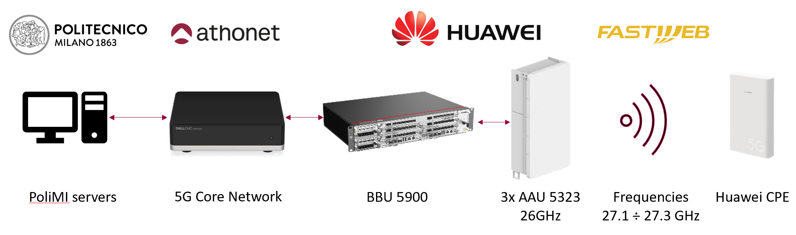
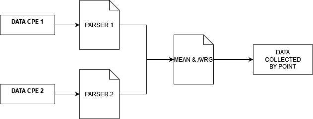
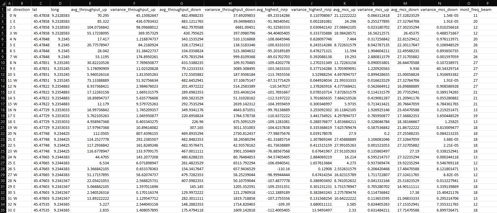
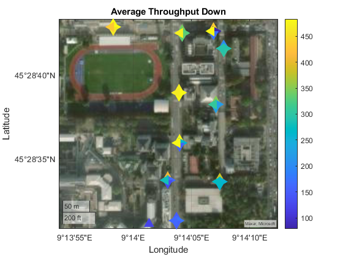
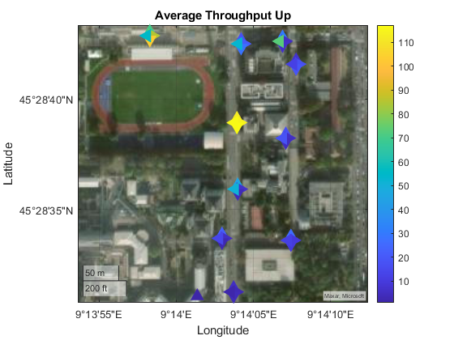
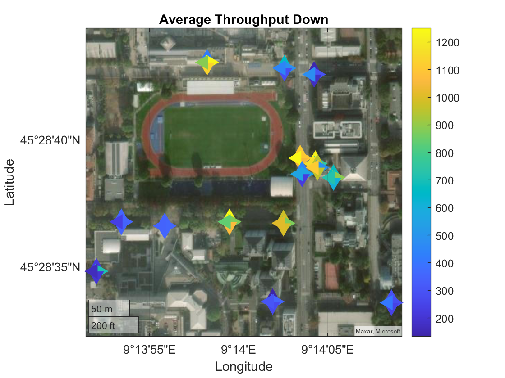
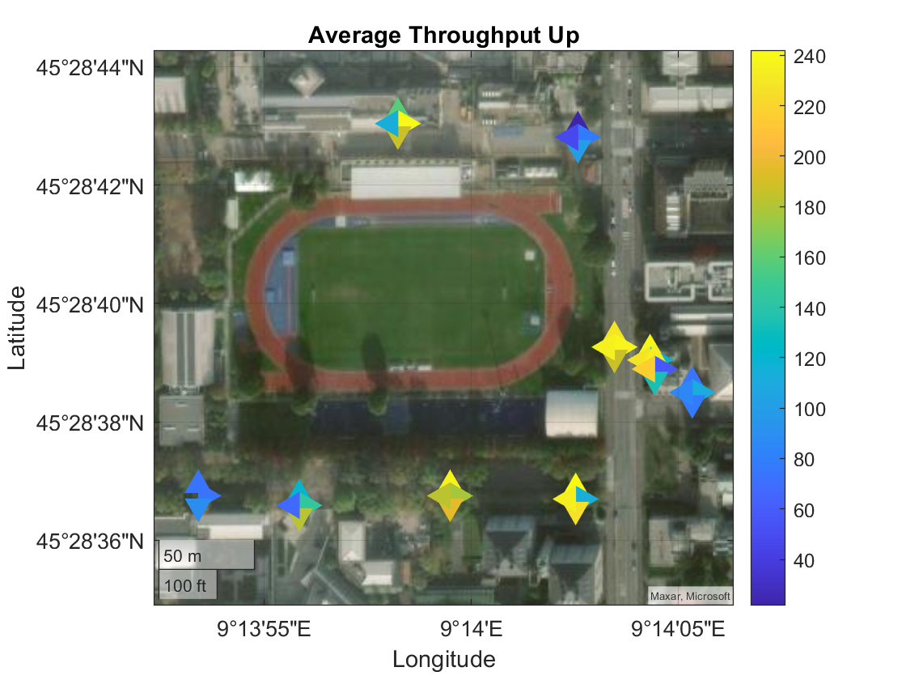

# High Frequency Lab Experience
## Measurement of high frequency antennas for ad-hoc 5G network and mathematical model for antennas reflector

By [Mattia Bevilacqua](https://github.com/Mattiabe98) and [Claudia Baz Alvarez](https://github.com/claualc) for PoliMi [ANTLAB](http://www.antlab.polimi.it/)

This article investigates high-frequency antennas in a standalone 5G network, emphasizing throughput variations influenced by line-of-sight (LoS) and non-line-of-sight (NLoS) conditions. The study showcases impressive mmWave speeds under favorable conditions and highlights the need to
address signal obstacles.
Additionally, a proposed mathematical model for 5G antenna reflectors is introduced to overcome obstacles and enhance signal quality. While experi mental validation is pending, the model suggests a promising avenue for robust and efficient 5G networks.

This repository contains:
* A set of CPE data parsers from 5G measurements that output a csv file:

 ``cpe_1_data_parser.py`` for Huawei 5G CPE Win
 
 ``cpe_2_data_parser.py`` for MEIG SRT835L

* A Python file ``prep_csv_for_matlab.py`` to prepare the csv for Matlab:

* A Matlab file ``plot_heatmap.m`` to plot the data

# Huawei CPE results:

# SRT835L results:

